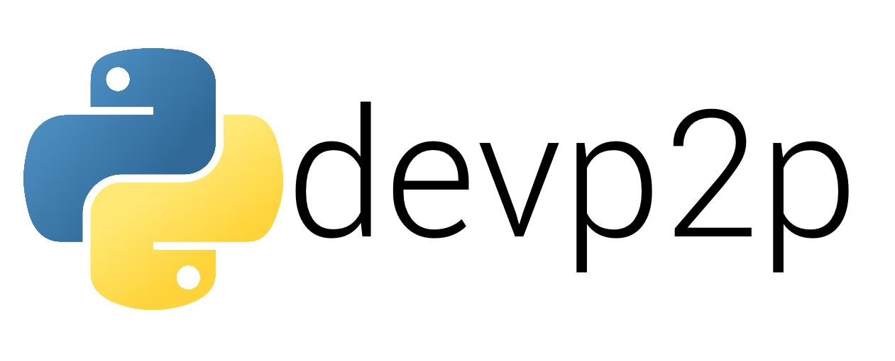

<!-- PROJECT SHIELDS -->
<!--
*** I'm using markdown "reference style" links for readability.
*** Reference links are enclosed in brackets [ ] instead of parentheses ( ).
*** See the bottom of this document for the declaration of the reference variables
*** for contributors-url, forks-url, etc. This is an optional, concise syntax you may use.
*** https://www.markdownguide.org/basic-syntax/#reference-style-links
-->

[](https://github.com/jmkemp20/pydevp2p/graphs/contributors)
[](https://github.com/jmkemp20/pydevp2p/network)
[](https://github.com/jmkemp20/pydevp2p/stargazers)
[](https://github.com/jmkemp20/pydevp2p/issues)
[](https://github.com/jmkemp20/pydevp2p/blob/main/LICENSE.txt)
[![LinkedIn][linkedin-shield]][linkedin-url]

<!-- PROJECT LOGO -->
<br />
<p align="center">
  <a href="https://github.com/jmkemp20/devp2p">
    
  </a>

  <h3 align="center">PYDEVP2P</h3>

  <p align="center">
    A Toolkit Helper Library for Ethereum ECIES and Devp2p
    <br />
    <a href="https://github.com/jmkemp20/pydevp2p"><strong>Explore the docs »</strong></a>
    <br />
    <br />
    <a href="https://github.com/ethereum/devp2p">devp2p</a>
    ·
    <a href="https://github.com/jmkemp20/pydevp2p/issues">Report Bug</a>
    ·
    <a href="https://github.com/jmkemp20/pydevp2p/issues">Request Feature</a>
  </p>
</p>

<!-- TABLE OF CONTENTS -->
<details open="open">
  <summary><h2 style="display: inline-block">Table of Contents</h2></summary>
  <ol>
    <li>
      <a href="#about-the-project">About The Project</a>
      <ul>
        <li><a href="#wireshark-dissector">Wireshark Dissector</a></li>
        <li><a href="#pip-deps">Dependencies</a></li>
      </ul>
    </li>
    <li>
      <a href="#getting-started">Getting Started</a>
      <ul>
        <li><a href="#prerequisites">Prerequisites</a></li>
        <li><a href="#installation">Installation</a></li>
      </ul>
    </li>
    <li><a href="#usage">Usage</a></li>
    <li><a href="#roadmap">Roadmap</a></li>
    <li><a href="#contributing">Contributing</a></li>
    <li><a href="#license">License</a></li>
    <li><a href="#contact">Contact</a></li>
  </ol>
</details>

<!-- ABOUT THE PROJECT -->

## About The Project

This library is meant to serve as a single tool to analyze, dissect, and decipher devp2p communication amongst Ethereum nodes. The goal is to provide a devp2p cryptography, ecies, and rlpx library with very minimal 3rd party dependencies, keeping it easy to use and extensible. As existing python implementations of devp2p have become deprecated by the use of certain 3rd party packages, it is important to create a tool that can be quickly and easily used to aid developers, analysts and general interest.

This tool is not meant to spin up a devp2p network, nor communicate amongst other networks. It is purely meant to provide an interface to common functions, tools used throughout devp2p, including but limited to: ECIES (ECC, ECDH, ECDSA), secp256k1 calculations, RLP decoding and encoding, RLPx (decryption, encryption and decoding), and discv4/v5. While also providing a learning mechanism to break down the not-so-well documented devp2p schema.

This library is very heavily based on the way [go-ethereum](https://github.com/ethereum/go-ethereum) implements p2p communication and their cryptography schema, while also providing general ECIES deciphering tools.

<!--[![Product Name Screen Shot][product-screenshot]](https://example.com)-->

### Wireshark Dissector

TBD: This will work hand in hand with an upcoming python3.10 <-> LUA bridge that will be used to provide Wireshark dissectors to decipher in real-time the inner-workings of a devp2p network.

### Pip Deps

- [pycryptodome](https://www.pycryptodome.org/)
- [eth-keys](https://github.com/ethereum/eth-keys)
- [rlp](https://github.com/ethereum/pyrlp)

<!-- GETTING STARTED -->

## Getting Started

To get a local copy up and running follow these simple steps.

### Prerequisites

In order to get started some ubuntu deps "may" need to be installed, then clone the repo and install the pip package like normal

- Ubuntu dependencies
  ```sh
  sudo apt-get install libssl-dev build-essential automake
  ```

### Installation

1. Clone the repo
   ```sh
   git clone https://github.com/jmkemp20/pydevp2p.git
   ```
2. Install pydevp2p via setup.py
   ```sh
   cd pydevp2p && pip install .
   ```

<!-- USAGE EXAMPLES -->

## Usage

Coming soon!

_For more examples, please refer to the [Documentation](https://example.com)_

<!-- ROADMAP -->

## Roadmap

See the [open issues](https://github.com/jmkemp20/pydevp2p/issues) for a list of proposed features (and known issues).

<!-- CONTRIBUTING -->

## Contributing

Contributions are what make the open source community such an amazing place to be learn, inspire, and create. Any contributions you make are **greatly appreciated**.

1. Fork the Project
2. Create your Feature Branch (`git checkout -b feature/AmazingFeature`)
3. Commit your Changes (`git commit -m 'Add some AmazingFeature'`)
4. Push to the Branch (`git push origin feature/AmazingFeature`)
5. Open a Pull Request

<!-- LICENSE -->

## License

Distributed under the MIT License. See `LICENSE` for more information.

<!-- CONTACT -->

## Contact

Joshua Kemp - kemp3jm@dukes.jmu.edu

Project Link: [https://github.com/jmkemp20/pydevp2p](https://github.com/jmkemp20/pydevp2p)

<!-- ACKNOWLEDGEMENTS

## Acknowledgements

- []()
- []()
- []()

<!-- MARKDOWN LINKS & IMAGES
<!-- https://www.markdownguide.org/basic-syntax/#reference-style-links -->

[linkedin-shield]: https://img.shields.io/badge/-LinkedIn-black.svg?style=for-the-badge&logo=linkedin&colorB=555
[linkedin-url]: https://www.linkedin.com/in/joshua-kemp20/
